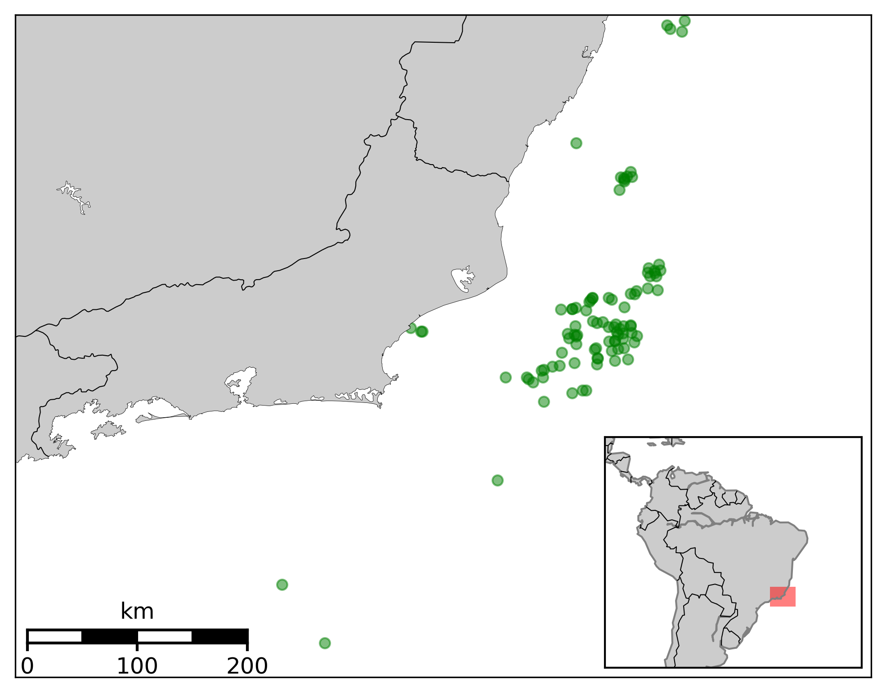

# Basemap Plots

Here I made a map that I used for my Phd Thesis.

Brazil gets most of its oil & gas from offshore units scattered in southwest atlantic coast.

|Maritime unit   | Longitude  | Latitude   |
|----------------|------------|------------|
| MU-01          | -40.425838 | -22.436926 |
| MU-02          | -40.413088 | -22.449015 |
| MU-03          | -40.331275 | -22.253827 |
| MU-04          | -40.763851 | -22.796269 |

Considering the position of offshore units just like the table above we want to generate a plot with a brazilian map, the unitis scattered in the ocean and a smaller subplot show the region located in relation to South America and a distânce scale for referente, just as the bellow:

